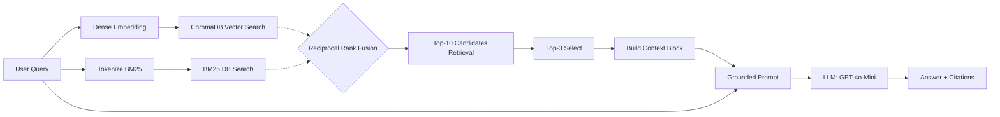

# Architecture — RAG Pipeline (Day 08 Lab)

> Template: Điền vào các mục này khi hoàn thành từng sprint.
> Deliverable của Documentation Owner.

## 1. Tổng quan kiến trúc

```
[Raw Docs]
    ↓
[index.py: Preprocess → Chunk → Embed → Store]
    ↓
[ChromaDB Vector Store]
    ↓
[rag_answer.py: Query → Retrieve → Rerank → Generate]
    ↓
[Grounded Answer + Citation]
```

**Mô tả ngắn gọn:**
> Hệ thống là một trợ lý ảo RAG nội bộ dành cho khối CS và IT Helpdesk. Tính năng chính là truy xuất (retrieve) các chính sách (policy), chuẩn SLA, và tài liệu hướng dẫn (SOPs), từ đó sinh ra câu trả lời dựa trên nội dung được trích xuất nhằm giúp nhân viên tra cứu thông tin nhanh chóng, chính xác và giảm thiểu rủi ro sai sót trong quá trình hỗ trợ người dùng.

---

## 2. Indexing Pipeline (Sprint 1)

### Tài liệu được index
| File | Nguồn | Department | Số chunk |
|------|-------|-----------|---------|
| `policy_refund_v4.txt` | policy/refund-v4.pdf | Customer Support | ~10-15 |
| `sla_p1_2026.txt` | support/sla-p1-2026.pdf | IT Helpdesk | ~5-10 |
| `access_control_sop.txt` | it/access-control-sop.md | IT Security | 8 |
| `it_helpdesk_faq.txt` | support/helpdesk-faq.md | IT Helpdesk | ~10-15 |
| `hr_leave_policy.txt` | hr/leave-policy-2026.pdf | HR | ~10-15 |

### Quyết định chunking
| Tham số | Giá trị | Lý do |
|---------|---------|-------|
| Chunk size | 400 (khoảng 1600 ký tự) | Kích thước vừa phải để cung cấp đủ ngữ cảnh cho LLM generation mà vẫn tối ưu context window. |
| Overlap | 80 (khoảng 320 ký tự) | Cần thiết để duy trì tính liền mạch của ngữ cảnh giữa các chunk khi vượt quá giới hạn size. |
| Chunking strategy | Heading-based + Paragraph-based | Tận dụng cấu trúc heading (`=== ... ===`) để gắn metadata theo từng section. |
| Metadata fields | source, section, effective_date, department, access | Phục vụ việc lọc (filtering) và tạo prefix cho chuỗi truy xuất nhằm trích dẫn nguồn. |

### Embedding model
- **Model**: `AITeamVN/Vietnamese_Embedding` (Local - SentenceTransformers)
- **Vector store**: ChromaDB (PersistentClient)
- **Similarity metric**: Cosine Distance

---

## 3. Retrieval Pipeline (Sprint 2 + 3)

### Baseline (Sprint 2)
| Metric | Average Score |
|--------|--------------|
| Faithfulness | 5.00/5 |
| Relevance | 4.20/5 |
| Context Recall | 2.78/5 |
| Completeness | 3.90/5 |

### Variant (Sprint 3)
| Tham số | Giá trị | Thay đổi so với baseline |
|---------|---------|------------------------|
| Strategy | Hybrid (Dense + Sparse BM25) | Kết hợp kết quả từ Dense Retrieval và Sparse Retrieval thông qua Reciprocal Rank Fusion (RRF). |
| Top-k search | 10 | Không đổi |
| Top-k select | 3 | Không đổi |
| Rerank | Không | Không đổi |
| Query transform | Không | Không đổi |

**Lý do chọn variant này:**
> **Kết hợp Hybrid với RRF**: Retrieval Hybrid (kết hợp Dense và BM25) được chọn cho variant bởi lẽ dữ liệu nguồn (Corpus) chứa cả nội dung ngôn ngữ tự nhiên bình thường (các policy) và các từ khoá, ký hiệu đặc trưng như mã lỗi `ERR-403-AUTH`, thẻ ticket `P1`, v.v. Các mô hình ngữ nghĩa đôi khi gặp khó khi xử lý các từ chắp vá. BM25 giải quyết vấn đề bằng keyword search hiệu quả, phối hợp qua RRF với trọng số cho Dense là 0.6 và Sparse là 0.4.

---

## 4. Generation (Sprint 2)

### Grounded Prompt Template
```text
Bạn là trợ lý nội bộ. Chỉ được trả lời dựa trên ngữ cảnh đã trích dẫn bên dưới.

Quy tắc bắt buộc:
1) Nếu ngữ cảnh KHÔNG chứa thông tin đủ để trả lời (ví dụ: mã lỗi không xuất hiện, không có điều khoản liên quan), trả lời CHÍNH XÁC một câu:
   "Không đủ dữ liệu trong tài liệu để trả lời câu hỏi này."
2) Không suy đoán, không dùng kiến thức bên ngoài ngữ cảnh.
3) Khi trả lời được, trích dẫn nguồn bằng số trong ngoặc như [1], [2] tương ứng đoạn ngữ cảnh.
4) Trả lời ngắn gọn, rõ ràng, cùng ngôn ngữ với câu hỏi.

Câu hỏi: {query}

Ngữ cảnh:
{context_block}

Trả lời:
```

### LLM Configuration
| Tham số | Giá trị |
|---------|---------|
| Model | `gpt-4o-mini` |
| Temperature | 0 (nhằm giảm thiểu tối đa Hallucination và làm dữ liệu chấm điểm ổn định hơn) |
| Max tokens | 700 |

---

## 5. Failure Mode Checklist

> Dùng khi debug — kiểm tra lần lượt: index → retrieval → generation

| Failure Mode | Triệu chứng | Cách kiểm tra |
|-------------|-------------|---------------|
| Index lỗi | Retrieve về docs cũ / sai version | `inspect_metadata_coverage()` trong `index.py` |
| Chunking tệ | Chunk cắt giữa điều khoản, ngữ cảnh rời rạc | `list_chunks()` và phân tích text preview kết quả |
| Retrieval lỗi | Không tìm được expected source | Thông qua điểm Recall (`score_context_recall()`) ở bước Eval |
| Generation lỗi | Sinh câu trả lời ảo (Hallucination) hoặc không nhắc đến nguồn | Kiểm tra metric `faithfulness` qua pipeline LLM-as-a-judge ở `eval.py` |
| Token overload | Context quá dài hoặc "Lost in the middle" | Nhìn vào logs để kiểm tra tổng block context xây dựng trong `build_context_block()` |

---

## 6. Diagram


